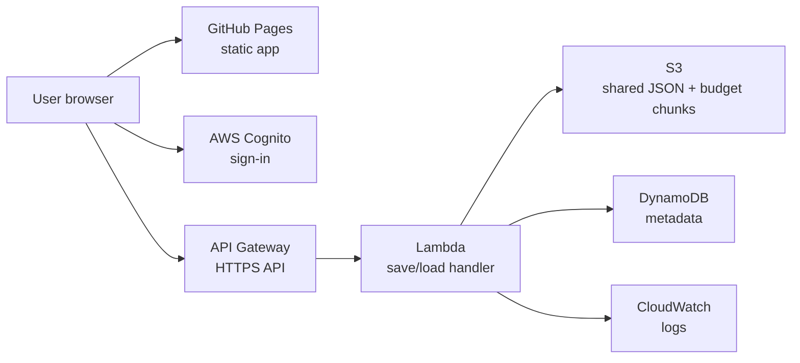

# The Gambia Malaria Budgeting Tool

A browser-based tool for building, costing, visualising, comparing, and exporting multi-year malaria intervention budgets for The Gambia.

The hosted app is available at:

<https://path-global-health.github.io/gmb-malaria-budget-app/>

Access to the hosted app is controlled through AWS Cognito sign-in. Shared scenarios, cost sets, and generated budgets are stored in AWS so authorised users can work from different browsers or computers.

## What This Repository Contains

This repository contains the static JavaScript application and deployment files for the Gambia malaria budgeting app.

Key folders:

| Folder | Purpose |
|---|---|
| `dist/` | Static files deployed to GitHub Pages |
| `js/` | Application logic, UI, state handling, and budget engine |
| `css/` | App styling |
| `data/` | Reference population, incidence, geography, and default cost data |
| `technical-management/` | Technical notes, setup documentation, and handover materials |
| `.github/workflows/` | GitHub Actions workflow for GitHub Pages deployment |

## How The App Works

The app is a static HTML/CSS/JavaScript application. It does not use Shiny, React, Node, or a traditional server-rendered backend.

The budgeting workflow is:

1. **Scenario specification**: define interventions, years, geography, coverage, product choices, and assumptions.
2. **Cost specification**: review or edit unit costs.
3. **Budget generation**: combine a scenario and cost set to generate detailed budget line items.
4. **Budget visualisation**: inspect totals, charts, maps, top cost elements, and diagnostics.
5. **Budget comparison**: compare generated budgets against one another.

The budget engine calculates quantities and costs in the browser. Detailed `costLineRows` are the audit source of truth; summaries, visualisations, comparisons, and Excel exports aggregate from those line-level rows.

## Hosting And Shared Storage

The app interface is hosted with GitHub Pages. Shared storage and sign-in use AWS.

Current architecture:



AWS resources are in `us-east-2`.

The longer technical handover and replication guide is here:

[technical-management/hosting-and-aws-walkthrough.md](technical-management/hosting-and-aws-walkthrough.md)

## Shared Data Behaviour

The hosted app uses:

- **Cognito** to restrict access to permitted users.
- **API Gateway + Lambda** to expose protected save/load endpoints.
- **S3** for shared app state and large generated budget chunks.
- **DynamoDB** for small metadata/audit records.
- **IndexedDB** in the browser as a local cache and fallback.

Large generated budgets are uploaded in chunks because detailed cost-line budget objects can be too large for a single API request.

The app header reports sync state, for example:

```text
Shared data loaded: 6 scenario(s), 1 cost set(s), 1 budget(s)
Shared data saved: 6 scenario(s), 1 cost set(s), 1 budget(s)
```

Operational rule:

> Use **Sync now** from a browser that contains the budget library you want to preserve. Empty browsers are guarded against overwriting shared budgets.

## Adding Users

Users are managed in AWS Cognito.

1. Open AWS Console.
2. Go to **Amazon Cognito**.
3. Open the Gambia app user pool.
4. Go to **User management > Users**.
5. Create the user with their email address.
6. Provide the temporary password securely if Cognito email invitations do not arrive.

The user opens the hosted app, signs in, and sets a new password when prompted.

## Deployment

The GitHub Pages deployment is handled by GitHub Actions.

Typical deployment flow:

1. Update source files.
2. Copy updated static files into `dist/` if the changed file is used by the deployed app.
3. Commit changes.
4. Push to `main`.
5. GitHub Actions publishes `dist/` to GitHub Pages.

When testing after deployment, use a hard refresh:

```text
Ctrl + Shift + R
```

Version query strings such as `js/state/cloud.js?v=9` are used to help browsers load the latest files.

## Local Use

The app can still run locally as static files for development and testing. Local copies run in local-only mode unless hosted at the configured GitHub Pages URL.

Open `index.html` directly or serve the folder with a simple static file server. Locally saved data is stored in the browser on that machine.

## Monitoring And Costs

AWS usage should be monitored in **Billing and Cost Management**.

Recommended services to watch:

- Amazon Cognito
- AWS Lambda
- Amazon API Gateway
- Amazon S3
- Amazon DynamoDB
- Amazon CloudWatch

Recommended setup:

- Enable Cost Explorer.
- Create an AWS Budget alert, for example `$5` or `$10` per month.
- Add alert emails at 80% and 100%.

## Troubleshooting

Common messages:

| Message | Meaning |
|---|---|
| `Shared data saved` | AWS save completed |
| `Shared data loaded` | AWS load completed |
| `Shared save skipped: this browser has 0 local budgets` | App prevented an empty browser from overwriting shared data |
| `Loaded 1 budget(s), but 1 detail file(s) failed` | Budget summary exists, but detailed S3 chunks are missing or incomplete |
| `Internal Server Error` | Check Lambda CloudWatch logs |

For detailed troubleshooting, see:

[technical-management/hosting-and-aws-walkthrough.md](technical-management/hosting-and-aws-walkthrough.md)

## Maintainer Notes

Important files:

| File | Purpose |
|---|---|
| `js/state/cloud.js` | Cognito login and AWS shared save/load logic |
| `js/state/persistence.js` | Browser persistence and shared/local merge behaviour |
| `js/engine/quantification.js` | Intervention quantity calculations |
| `js/engine/costing.js` | Line-item costing logic |
| `js/util/budget-export.js` | Excel export logic |
| `data/default-unit-costs.js` | Default cost rows |

Current backend Lambda code is documented in the walkthrough. If Lambda is edited in the AWS Console, keep a copy of the deployed code in the project documentation or repository.

## Licence And Ownership

Built for PATH for The Gambia malaria budgeting use case. Confirm organisational licensing and sharing rules before making the repository or hosted app public.
