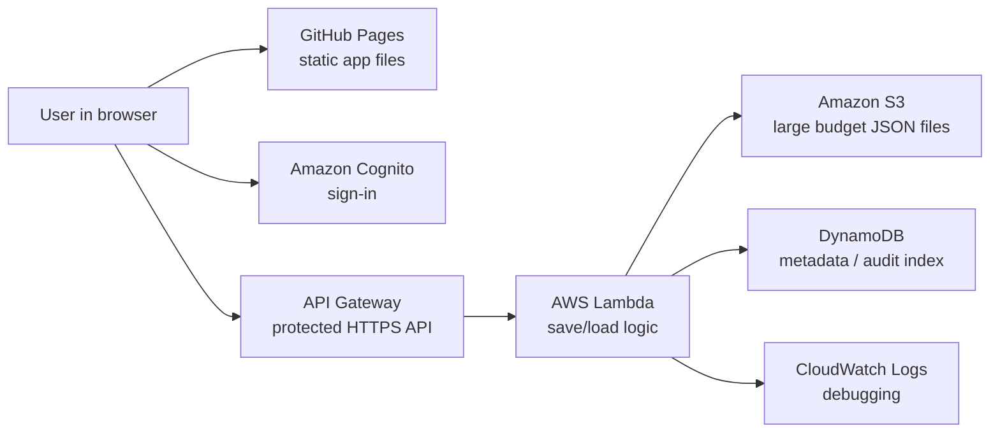
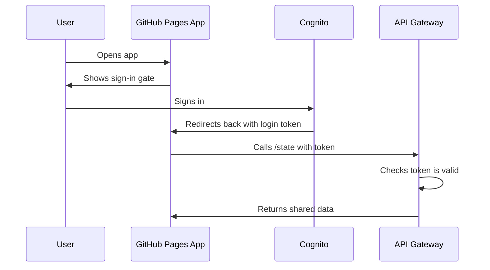
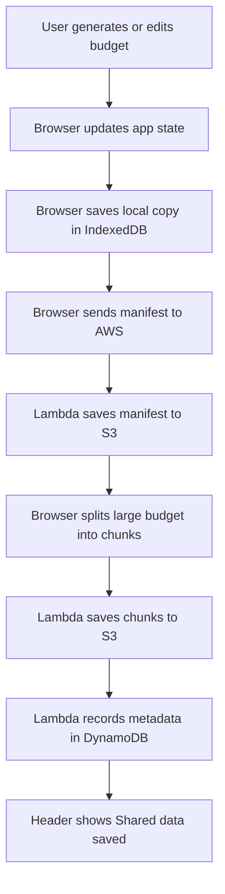
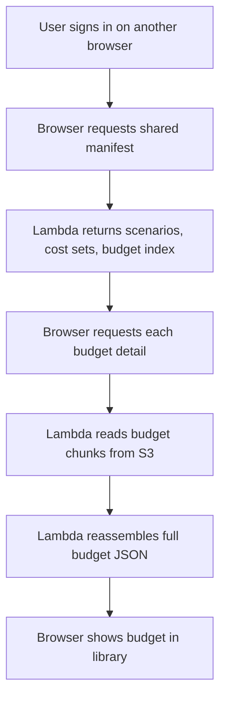
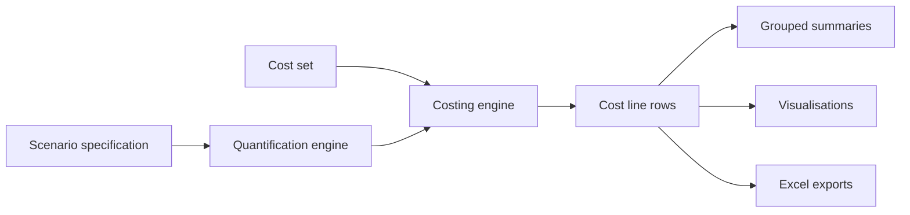
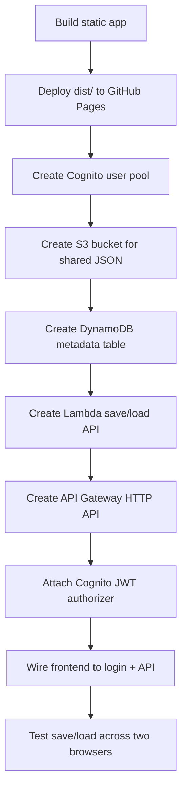

# The Gambia Malaria Budgeting App

## Hosting, Shared Storage, AWS Setup, And Replication Guide

This document explains how the Gambia malaria budgeting app is built, hosted, and connected to shared AWS storage. It has two purposes:

1. **Technical note and handover documentation** for the current Gambia budgeting app.
2. **Replication guide and template** for setting up similar static planning or budgeting tools in future.

It is written for programme and technical staff who are not software developers but need to understand what has been set up, how it works, what to maintain, and how to reproduce the same pattern.

---

## 1. What The App Is

The Gambia Malaria Budgeting Tool is a static browser-based budgeting application. It helps users define malaria intervention scenarios, attach unit costs, generate multi-year budgets, inspect warnings, visualise results, compare budgets, and export Excel workbooks.

The app is built with:

- **HTML** for page structure.
- **CSS** for layout and styling.
- **JavaScript** for the budgeting logic, data processing, charts, downloads, and saving/loading data.
- **No Shiny server, Node server, or traditional backend web server** for the app interface itself.

The deployed app URL is:

<https://path-global-health.github.io/gmb-malaria-budget-app/>

The source repository is:

<https://github.com/PATH-Global-Health/gmb-malaria-budget-app>

### What The App Is Not

This is useful context because it affects hosting, maintenance, and user expectations.

The app is **not**:

- A Shiny app.
- A database application with a traditional server.
- A real-time multi-user editing system like Google Sheets.
- A system of record for expenditure tracking.
- A finance/accounting platform.
- A fully automated donor-budget submission tool.

The app is best understood as:

> A browser-based budgeting and scenario analysis tool with controlled sign-in and shared saved state.

---

## 2. Why We Used GitHub Pages Plus AWS

The app itself can run as static files in a browser, so GitHub Pages is a good fit for hosting the interface. However, GitHub Pages cannot securely store shared user data by itself.

The key limitation is:

> A GitHub Pages app runs entirely in each user’s browser. It cannot safely contain AWS access keys or database credentials.

So we separated the system into two parts:

- **GitHub Pages** hosts the app files.
- **AWS** handles sign-in and shared saved data.

This means the app remains lightweight and easy to host, while shared budgets are stored in a controlled AWS backend.

---

## 3. High-Level Architecture



Plain-language version:

1. The user opens the app from GitHub Pages.
2. The hosted app requires the user to sign in.
3. Cognito confirms the user is allowed.
4. The app calls a protected AWS API.
5. Lambda receives save/load requests.
6. S3 stores the larger generated budget files.
7. DynamoDB stores small metadata about what was saved.
8. CloudWatch stores logs if something fails.

---

## 4. Current AWS Resources

All resources were created in:

```text
AWS region: us-east-2, Ohio
```

Current resources:

| Purpose | AWS Service | Current Resource |
|---|---|---|
| User sign-in | Cognito User Pool | `us-east-2_coJiuB4Le` |
| Browser-facing API | API Gateway HTTP API | `gmb-malaria-budget-app-api` |
| Save/load backend logic | Lambda | `gmb-malaria-budget-app-api` |
| Large shared state files | S3 | `path-gmb-malaria-budget-app` |
| Metadata/audit records | DynamoDB | `gmb-malaria-budget-app-records` |
| Backend logs | CloudWatch Logs | Lambda log group |
| Static hosting | GitHub Pages | `PATH-Global-Health/gmb-malaria-budget-app` |

### Settings To Preserve

These settings are important for the app to keep working:

| Setting | Current Value |
|---|---|
| GitHub Pages URL | `https://path-global-health.github.io/gmb-malaria-budget-app/` |
| Cognito region | `us-east-2` |
| Cognito user pool ID | `us-east-2_coJiuB4Le` |
| Cognito app client ID | `7e8ggoqir9pu1vc0vuplj2k3qs` |
| Cognito domain | `https://us-east-2cojiub4le.auth.us-east-2.amazoncognito.com` |
| API Gateway base URL | `https://2sw09cgqc3.execute-api.us-east-2.amazonaws.com` |
| S3 bucket | `path-gmb-malaria-budget-app` |
| DynamoDB table | `gmb-malaria-budget-app-records` |
| Lambda function | `gmb-malaria-budget-app-api` |
| Workspace ID | `gambia-default` |
| Allowed origin | `https://path-global-health.github.io` |

---

## 5. What GitHub Pages Does

GitHub Pages serves the static files in the app’s `dist/` folder.

The deployed URL is:

```text
https://path-global-health.github.io/gmb-malaria-budget-app/
```

GitHub Actions deploys the site whenever changes are pushed to the `main` branch.

Important note:

> The sign-in gate protects access through the app interface and protects shared data in AWS. The static JavaScript, HTML, and CSS files themselves should not contain secrets. This is normal for static web apps.

We therefore do **not** store AWS secret keys, private credentials, or sensitive programme data in the app source files.

### GitHub Pages Deployment Workflow

The repository includes a GitHub Actions workflow that deploys the static `dist/` folder to GitHub Pages.

In plain terms:

1. Changes are made locally.
2. The app files in `dist/` are updated.
3. The changes are committed and pushed to GitHub.
4. GitHub Actions publishes `dist/` to GitHub Pages.
5. Users see the updated app after the Pages deployment finishes.

When testing a deployment, use a hard refresh:

```text
Ctrl + Shift + R
```

Because browsers cache JavaScript files, the app uses version query strings such as:

```text
js/state/cloud.js?v=9
js/main.js?v=7
```

These help force browsers to load the latest version.

---

## 6. What Cognito Does

Amazon Cognito manages user sign-in.

In this setup:

- Users must exist in the Cognito user pool.
- Users sign in through the Cognito hosted login page.
- After sign-in, Cognito returns the user to the GitHub Pages app.
- The app receives a login token.
- The app uses that token when calling the AWS API.



The current Cognito app client is configured with:

```text
Callback URL:
https://path-global-health.github.io/gmb-malaria-budget-app/

Sign-out URL:
https://path-global-health.github.io/gmb-malaria-budget-app/
```

---

## 7. Adding Permitted Users

To add a user:

1. Open AWS Console.
2. Go to **Amazon Cognito**.
3. Open the user pool.
4. Go to **User management > Users**.
5. Click **Create user**.
6. Add the person’s email address.
7. Mark the email as verified if the option is available.
8. Create or generate a temporary password.
9. Share the app link and temporary password with the user through a secure channel.

The app link is:

```text
https://path-global-health.github.io/gmb-malaria-budget-app/
```

Current observation:

- Cognito invitation emails may not always arrive.
- Manual temporary-password sharing worked.
- The user should sign in, then Cognito will ask them to set a new password.

### Recommended User Onboarding Message

Example message to send to a new user:

```text
You have been added to the Gambia Malaria Budgeting Tool.

App link:
https://path-global-health.github.io/gmb-malaria-budget-app/

Username:
<your email address>

Temporary password:
<temporary password>

When you first sign in, Cognito should ask you to set a new password.
```

Temporary passwords should be sent through an appropriate secure channel.

---

## 8. What API Gateway Does

API Gateway provides the HTTPS API that the browser calls.

Current API:

```text
https://2sw09cgqc3.execute-api.us-east-2.amazonaws.com
```

Routes:

| Route | Purpose | Protected? |
|---|---|---|
| `GET /health` | Basic backend health check | No |
| `GET /state` | Load shared app state | Yes |
| `PUT /state` | Save shared app state | Yes |

The protected routes use a Cognito JWT authorizer. This means a browser request must include a valid Cognito login token.

---

## 9. What Lambda Does

Lambda is the backend function that handles save and load requests.

It does not run the budgeting calculations. The calculations happen in the browser. Lambda only stores and retrieves data.

Lambda responsibilities:

- Check what API route was called.
- Save manifest data to S3.
- Save large budget data to S3 in chunks.
- Load shared state from S3.
- Reassemble chunked budgets when loading.
- Write small metadata records to DynamoDB.
- Return errors if something goes wrong.

Why chunking was needed:

Generated budgets contain detailed cost lines, quantity rows, diagnostics, and export-ready data. These objects can be too large to send as one API request. We therefore split each budget into smaller chunks before saving it.

---

## 10. How Shared Data Is Stored

The app now stores shared data in two layers:

### S3

S3 stores the actual JSON files.

Conceptual S3 layout:

```text
workspaces/gambia-default/state/manifest.json
workspaces/gambia-default/state/budget-chunks/<budget-id>/manifest.json
workspaces/gambia-default/state/budget-chunks/<budget-id>/0.txt
workspaces/gambia-default/state/budget-chunks/<budget-id>/1.txt
workspaces/gambia-default/state/budget-chunks/<budget-id>/2.txt
...
```

The manifest contains:

- Scenarios.
- Cost sets.
- Budget summaries.
- Budget index.
- Removed/default seed markers.

The chunk files contain:

- Full generated budget data.
- Cost line rows.
- Quantity rows.
- Diagnostics.
- Export-ready detail.

### DynamoDB

DynamoDB stores small metadata records, for example:

- What was saved.
- When it was saved.
- Who saved it.
- Approximate byte size.
- Number of scenarios, cost sets, and budgets.

DynamoDB is not the main budget file store. It is an index/audit support table.

---

## 11. Save And Load Flow



Loading in another browser:



---

## 12. Local Browser Storage

The app still uses browser storage as a fallback and speed layer.

Local storage used:

- **IndexedDB** for saved scenarios, cost sets, and generated budgets.
- `localStorage` only as an older fallback/migration path.

Why this matters:

- If AWS is temporarily unavailable, the app can still preserve data in the current browser.
- The original browser can repair shared AWS state if the shared copy is incomplete.
- Empty browsers are now blocked from overwriting shared budgets with `0 budget(s)`.

Important operational rule:

> Use **Sync now** from a browser that has the budget library you want to preserve.

Do not use Sync now from a browser that has no budgets unless you intentionally want to save an empty workspace.

### Practical Sync Rules

For ordinary users:

- Generate or edit budgets normally.
- Wait for the header to say `Shared data saved`.
- Use **Sync now** only if something looks out of date or if asked during troubleshooting.

For administrators:

- If two browsers disagree, trust the browser that has the correct budget library.
- Hard refresh that browser.
- Click **Sync now** from that browser.
- Confirm the saved count is correct.
- Then hard refresh the other browser.

---

## 13. How Budget Generation Works

Budget generation happens in the browser JavaScript engine.

The high-level flow is:



Key points:

- The scenario defines interventions, years, coverage, geography, product/type selections, buffers, and assumptions.
- The quantification engine estimates commodity quantities and target populations.
- The costing engine matches quantities to cost rows.
- Detailed line-item costs are the source of truth.
- Summaries, charts, comparisons, and downloads aggregate from line items.

---

## 14. Current Budget Engine Features

The current engine includes:

- Exact product/type matching for typed commodities.
- Shared blank-type add-on cost rows.
- Detailed line-item costing.
- Aggregated cost summaries from line-item rows.
- IRS product options:
  - `Actellic`
  - `SumiShield`
  - `Fludora Fusion`
- SMC age-pack costing:
  - `SP+AQ 3-11m`
  - `SP+AQ 12-59m`
- IPTsc age-pack costing:
  - `DHA-PPQ 5-11y`
  - `DHA-PPQ 12-15y`
- Per-dose, per-pack, per-child, per-person, per-year, and one-off unit handling.
- Pre-generation warnings for missing typed procurement, unsupported units, skipped rows, and zero-quantity cases.
- Stale-budget warnings when source scenarios or cost sets change after a budget is generated.
- Excel exports with line-level detail.

---

## 15. How The Header Sync Messages Should Behave

Useful header messages:

```text
Shared data loaded: 6 scenario(s), 1 cost set(s), 1 budget(s)
```

This means AWS shared data was loaded.

```text
Saving shared manifest...
Saving shared budget 1 of 1, chunk 1 of N...
Shared data saved: 6 scenario(s), 1 cost set(s), 1 budget(s)
```

This means data was saved to AWS.

```text
Shared save skipped: this browser has 0 local budgets
```

This means the app prevented an empty browser from overwriting shared budgets.

```text
Loaded 1 budget(s), but 1 detail file(s) failed
```

This means the app found the budget summary, but the detailed S3 budget file/chunks were incomplete or unavailable.

---

## 16. Monitoring Usage And Costs

Use AWS Billing and Cost Management.

Recommended checks:

1. Open **Billing and Cost Management**.
2. Open **Cost Explorer**.
3. Group costs by service.
4. Watch:

```text
Amazon Cognito
AWS Lambda
Amazon API Gateway
Amazon S3
Amazon DynamoDB
Amazon CloudWatch
```

Recommended budget alert:

1. Go to **AWS Budgets**.
2. Create a monthly cost budget.
3. Start with a small threshold, for example:

```text
$5 or $10 per month
```

4. Add email alerts at:

```text
80%
100%
```

For a small group of around 10 users, costs should usually be low, but alerts are still important because AWS charges are usage-based.

### Simple Cost-Risk Table

| Service | What Could Increase Cost | Practical Risk For This App |
|---|---|---|
| Cognito | Many monthly active users | Low for around 10 users |
| Lambda | Very frequent saves/loads | Low |
| API Gateway | Very frequent API calls | Low |
| S3 | Many large generated budgets | Low to moderate, depending on usage |
| DynamoDB | Many metadata writes/reads | Low |
| CloudWatch | Very verbose logs or repeated errors | Low, but worth watching |

The highest practical risk is usually not normal use. It is repeated errors creating many logs or repeated large saves during testing.

---

## 17. CloudWatch Logs

If the app shows a shared save/load error:

1. Go to AWS Lambda.
2. Open `gmb-malaria-budget-app-api`.
3. Go to **Monitor**.
4. Open **CloudWatch logs**.
5. Look at the most recent log stream.

Useful things to look for:

- `PUT /state failed`
- `GET budget failed`
- S3 permission errors.
- DynamoDB permission errors.
- JSON parse errors.
- Missing key errors.

### Common Error Meanings

| App/Header Error | Likely Meaning | Action |
|---|---|---|
| `Shared save failed` | AWS save request failed | Check Lambda logs |
| `Internal Server Error` | Lambda failed while handling request | Check CloudWatch |
| `Loaded 1 budget(s), but 1 detail file(s) failed` | Budget summary exists but detailed S3 chunks are missing/incomplete | Regenerate or resync from browser with full budget |
| `Shared save skipped: this browser has 0 local budgets` | App prevented an empty browser from overwriting shared data | Use Sync now from browser with correct budget |
| User cannot sign in | Cognito user/password issue | Check Cognito user status |

---

## 18. Replicating This Setup For Another Tool

For another static JavaScript budgeting/planning tool, repeat this pattern.



Replication checklist:

- Create a GitHub repository.
- Add a GitHub Pages deployment workflow.
- Confirm the static app loads from GitHub Pages.
- Create a Cognito user pool.
- Create a Cognito app client with no client secret.
- Add callback and sign-out URLs.
- Create an S3 bucket.
- Create a DynamoDB table with:

```text
pk
sk
```

- Create a Lambda execution role.
- Give Lambda permission to read/write the S3 bucket and DynamoDB table.
- Create a Lambda function.
- Add environment variables:

```text
APP_BUCKET
APP_TABLE
WORKSPACE_ID
ALLOWED_ORIGIN
```

- Create API Gateway HTTP API routes:

```text
GET /health
GET /state
PUT /state
```

- Attach Cognito authorization to `GET /state` and `PUT /state`.
- Configure CORS for the GitHub Pages origin.
- Test:
  - Health check.
  - Sign-in.
  - Save in one browser.
  - Load in another browser.
  - Excel export.

---

## 18A. Replication Template

Use this as a copy/paste template for another tool.

### Project Details

| Item | Value |
|---|---|
| Tool name | `<tool name>` |
| GitHub organisation | `<GitHub org>` |
| GitHub repository | `<repo name>` |
| GitHub Pages URL | `https://<org>.github.io/<repo>/` |
| AWS account | `<account name/id>` |
| AWS region | `<region>` |
| Workspace ID | `<workspace-id>` |

### Planned AWS Resource Names

| Resource | Name |
|---|---|
| Cognito user pool | `<tool>-users` |
| Cognito app client | `<tool>-app` |
| S3 bucket | `<tool>-shared-state` |
| DynamoDB table | `<tool>-records` |
| Lambda function | `<tool>-api` |
| API Gateway HTTP API | `<tool>-api` |

### Step 1: Prepare Static App

Checklist:

- App runs locally.
- App can be built/copied into a static `dist/` folder.
- No secrets are stored in JavaScript files.
- Save/load code is separated from calculation logic.
- Generated outputs can be serialized as JSON.

Decision:

```text
Can this app run from static files only?
Yes / No
```

If no, GitHub Pages alone is not enough.

### Step 2: Create GitHub Repository

Checklist:

- Create repository under organisation.
- Add app source.
- Add `dist/` folder.
- Add GitHub Pages workflow.
- Confirm GitHub Pages deploys successfully.
- Confirm app loads from the Pages URL.

### Step 3: Create Cognito Sign-In

Checklist:

- Create Cognito user pool.
- Create app client with no client secret.
- Enable authorization code grant.
- Add callback URL:

```text
https://<org>.github.io/<repo>/
```

- Add sign-out URL:

```text
https://<org>.github.io/<repo>/
```

- Create at least one test user.
- Confirm sign-in redirects back to the app.

### Step 4: Create Shared Storage

Checklist:

- Create S3 bucket.
- Create DynamoDB table with:

```text
pk
sk
```

- Keep table simple unless there is a clear reason for more indexes.

### Step 5: Create Lambda Backend

Checklist:

- Create Lambda execution role.
- Give it CloudWatch logging permissions.
- Give it S3 read/write permissions for the bucket.
- Give it DynamoDB read/write permissions for the table.
- Add environment variables:

```text
APP_BUCKET=<bucket name>
APP_TABLE=<table name>
WORKSPACE_ID=<workspace id>
ALLOWED_ORIGIN=https://<org>.github.io
```

- Deploy Lambda code.
- Test `/health`.

### Step 6: Create API Gateway

Checklist:

- Create HTTP API.
- Integrate with Lambda.
- Add routes:

```text
GET /health
GET /state
PUT /state
```

- Leave `GET /health` public.
- Protect `GET /state` and `PUT /state` with Cognito JWT authorizer.
- Configure CORS:

```text
Origin:
https://<org>.github.io

Methods:
GET, PUT, OPTIONS

Headers:
content-type, authorization
```

### Step 7: Connect Frontend To AWS

Update frontend config:

```text
API base URL
Cognito domain
Cognito client ID
Redirect URL
```

Checklist:

- Hosted app shows sign-in gate.
- User can sign in.
- App can load shared state.
- App can save shared state.
- App can load shared state in another browser.

### Step 8: Test With Two Browsers

Test sequence:

1. Browser A signs in.
2. Browser A creates or generates saved data.
3. Browser A confirms `Shared data saved`.
4. Browser B signs in.
5. Browser B confirms `Shared data loaded`.
6. Browser B sees the same saved data.
7. Browser B does not overwrite data with an empty workspace.

### Step 9: Set Up Usage Monitoring

Checklist:

- Enable Cost Explorer.
- Create AWS Budget alert.
- Add email alerts.
- Check CloudWatch logs after first tests.

### Step 10: Handover

Record:

- GitHub repo.
- GitHub Pages URL.
- AWS region.
- Cognito user pool ID.
- Cognito app client ID.
- API Gateway URL.
- S3 bucket.
- DynamoDB table.
- Lambda function.
- Who can add users.
- Who receives budget alerts.
- Where this documentation lives.

---

## 18B. Future Tool Decision Checklist

Before reusing this setup, answer:

| Question | Why It Matters |
|---|---|
| Does the app run as static HTML/CSS/JS? | Required for GitHub Pages hosting |
| Does the app need shared saved data? | Determines whether AWS backend is needed |
| Are users a controlled small group? | Cognito user pool is practical |
| Are generated outputs large? | May need chunked S3 storage |
| Is real-time collaboration needed? | This setup does not provide live co-editing |
| Is sensitive data stored? | May require additional security review |
| Are audit trails required? | DynamoDB metadata may need expansion |
| Is offline work important? | Browser IndexedDB fallback is useful |

---

## 18C. Handover Checklist For This App

Use this before handing the app to another maintainer.

- [ ] GitHub repository access confirmed.
- [ ] AWS account access confirmed.
- [ ] At least two administrators can access Cognito.
- [ ] At least two administrators can access Billing.
- [ ] AWS Budget alert configured.
- [ ] Cognito user creation process tested.
- [ ] App sign-in tested.
- [ ] Budget save tested.
- [ ] Budget load tested in second browser.
- [ ] Excel export tested.
- [ ] CloudWatch log location known.
- [ ] Lambda code backed up or stored in repository/documentation.
- [ ] This walkthrough document shared with maintainers.

---

## 19. Main Lessons Learned

1. Static apps are easy to host, but shared data needs a backend.
2. GitHub Pages should not contain AWS credentials.
3. Cognito works well for a small permitted-user list.
4. Generated budgets can be large, so saving them as one JSON request is fragile.
5. Chunked S3 storage is safer for large generated budget detail.
6. Empty browsers must not overwrite shared data.
7. Header sync messages are important for non-technical users.
8. AWS Budgets should be enabled early, even for low expected usage.

---

## 20. Current Operational Guidance

For normal use:

1. User opens the app.
2. User signs in.
3. User generates or edits budgets.
4. App saves automatically.
5. User can click **Sync now** if they want to force-save their current browser state.

For troubleshooting:

1. Confirm the user is signed in.
2. Check the header message.
3. Hard refresh the app.
4. Use the original browser with the correct budget library to click **Sync now**.
5. Check CloudWatch logs if AWS returns an error.

For adding users:

1. Add user in Cognito.
2. Give them the app link.
3. If email invite does not send, provide a temporary password securely.
4. Ask them to sign in and set a new password.

---

## 21. Glossary

**API Gateway**  
The AWS service that exposes a secure web API URL for the browser.

**Cognito**  
The AWS sign-in service. It manages permitted users and login tokens.

**DynamoDB**  
A small AWS database used here for metadata and audit records.

**GitHub Pages**  
Static web hosting for the app interface.

**IndexedDB**  
Browser-local database storage. Used as a local fallback/cache.

**Lambda**  
Serverless backend code that saves and loads shared state.

**Manifest**  
A small shared file containing scenarios, cost sets, and budget summaries.

**S3**  
AWS object storage. Used for large JSON files and budget chunks.

**Static app**  
An app made of files that run directly in the browser, without a dedicated app server.

---

## 22. Summary

The app is now a static JavaScript budgeting tool hosted on GitHub Pages with AWS providing controlled sign-in and shared storage. The app calculates budgets in the browser, stores detailed generated budget data in S3, records metadata in DynamoDB, and uses Cognito/API Gateway/Lambda to keep shared data access controlled.

This setup is suitable for a small controlled group of users and can be replicated for similar PATH tools that need static hosting plus shared saved state.
