# The Gambia Malaria Budgeting Tool: User Guide

Live app: https://path-global-health.github.io/gmb-malaria-budget-app/

This guide is for programme users who will view, generate, compare, or export budgets. It is written as a practical walkthrough: what to click, what to check, what warnings mean, and how to avoid common mistakes. It does not require GitHub or AWS access.

## Quick Orientation

The app turns a malaria plan into a costed budget. You define what interventions are delivered, where they are delivered, in which years, and at what coverage. You then combine that scenario with a unit cost set to generate budget outputs, charts, maps, comparisons, and Excel exports.

The workflow is arranged across the top of the app:

1. Scenario specification: define the plan and intervention assumptions.
2. Cost specification: review or edit unit costs.
3. Budget generation: combine a scenario and cost set.
4. Budget visualisation: review one generated budget.
5. Budget comparison: compare two or more generated budgets.

The Methods tab is a reference section. It explains the formulas, assumptions, cost matching logic, and worked examples.

## Current Scope Of The Tool

The tool supports SNT-based budgeting for seven intervention areas:

- Mass ITN campaign
- Routine / continuous ITN
- Indoor residual spraying
- Seasonal malaria chemoprevention
- IPT for school-age children
- Malaria vaccine
- IPTp in pregnancy

The current version does not support:

- case management
- other malaria interventions
- programme or activity cost categories that are not represented in the uploaded/default unit cost file
- real-time expenditure tracking
- real-time co-editing
- GF detailed budget formatted data

This means the tool is best used for strategic planning, scenario comparison, funding gap discussions, and checking high-level budget drivers. It is not a replacement for a detailed activity workplan or financial expenditure system.

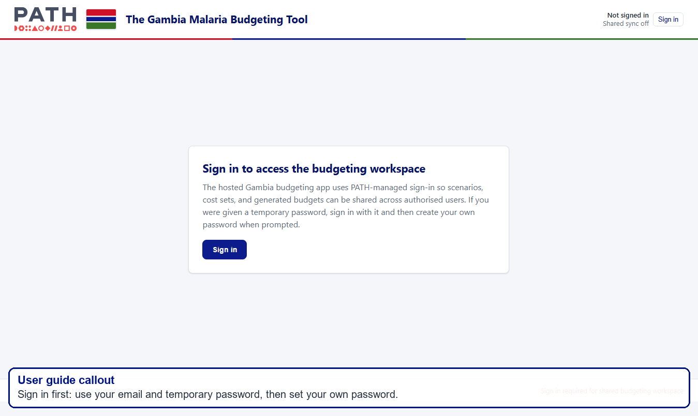

## Getting Started And Signing In

Open the app link in a browser:

https://path-global-health.github.io/gmb-malaria-budget-app/

Use your email address as your username.

Temporary password: `!malariatempPW26`

The first time you sign in, you should be asked to set your own password. After signing in, the app should load the shared workspace.

What to check after signing in:

- Your email address appears in the top-right corner.
- The shared saving status changes from sign-in/loading text to `Shared data loaded` or `Shared data saved`.
- The workflow tabs across the top are visible.

If the app does not load after signing in, refresh the page once and wait for the shared status to update.

## Shared Saving And Collaboration

The hosted app shares saved scenarios, cost sets, and generated budgets across authorised users. This is what lets a budget generated on one computer appear for another authorised user.

The top-right corner shows the shared saving status:

- `Shared data loaded` means the browser has loaded the shared workspace.
- `Shared data saved` means your latest saved work has reached shared storage.
- `Shared save skipped` means the app prevented this browser from overwriting shared budgets.

Important habits:

- Wait for `Shared data saved` before closing the browser.
- If you open the app in another browser, refresh and wait for `Shared data loaded`.
- Use `Sync now` only if asked during troubleshooting, or if you are sure that this browser has the budget library that should be preserved.
- Do not use `Sync now` from a browser that is empty or missing budgets unless you have been asked to do so.

The app is shared, but it is not live co-editing like Google Docs. If two people edit the same scenario or cost set at the same time, the last saved version may replace the other person's changes. Agree who is editing before making changes.

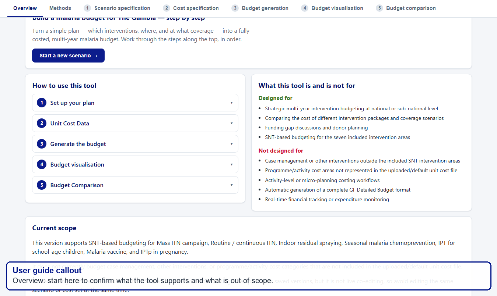

## Overview Page

The Overview page is the starting point. It tells you what the tool is for, what it is not for, and how the workflow is organised.

Use this page to orient yourself before editing anything:

1. Read the ?How to use this tool? steps.
2. Check the ?What this tool is and is not for? section.
3. Check the ?Current scope? note so you know which interventions are included.
4. Check the saved-work count at the bottom to see how many scenarios, cost sets, and generated budgets are available.

Tip: If you are only reviewing existing results, you may not need to edit scenarios or costs. Go straight to Budget visualisation or Budget comparison.

## Scenario Specification Walkthrough

Use Scenario specification to define the malaria plan. This is where you choose the plan years, risk stratification, intervention targeting, and intervention-specific assumptions.

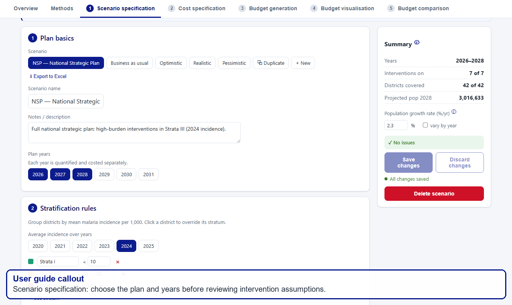

### Step 1: Choose Or Create A Scenario

At the top of the page, you will see scenario buttons such as NSP, Business as usual, Optimistic, Realistic, and Pessimistic.

You can:

- select an existing scenario to review it
- duplicate a scenario before making edits
- create a new scenario
- export scenario assumptions to Excel

Recommended approach: duplicate an existing scenario before making substantial edits. This preserves the original and makes comparisons easier later.

### Step 2: Review Plan Basics

Check the scenario name and description. The description should explain what the scenario represents, for example ?National Strategic Plan? or ?reduced funding scenario?.

Check the plan years. Each selected year is quantified and costed separately. If you remove a year, that year will not appear in the generated budget. If you add a year, the tool projects population using the population growth assumption.

What to check before moving on:

- The scenario name is clear enough for other users to understand.
- The selected years match the planning period you want to cost.
- The description explains any important assumptions or funding context.

### Step 3: Review Stratification Rules

Risk strata group districts by malaria incidence. The app uses incidence thresholds to classify districts into strata. These strata are then used to target interventions.

You can review:

- which incidence years are used
- the threshold values for each stratum
- the map and summary of districts in each stratum
- any district-level overrides

Caveat: If you change incidence thresholds, intervention targeting can change because districts may move between strata. Any existing budgets from the old scenario should be regenerated.

### Step 4: Review Intervention Targeting

Each intervention can be targeted to all areas, selected strata, selected regions, selected districts, or custom exclusions depending on the scenario setup.

Check carefully:

- whether each intervention is switched on or off
- which strata or districts are covered
- any excluded areas
- whether the number of districts covered matches your expectation

The Summary panel on the right helps you check how many interventions are on, how many districts are covered, and whether there are obvious issues.

### Step 5: Review Intervention Assumptions

Intervention assumptions are where most scenario differences are created. This section controls the quantities that will later be costed.

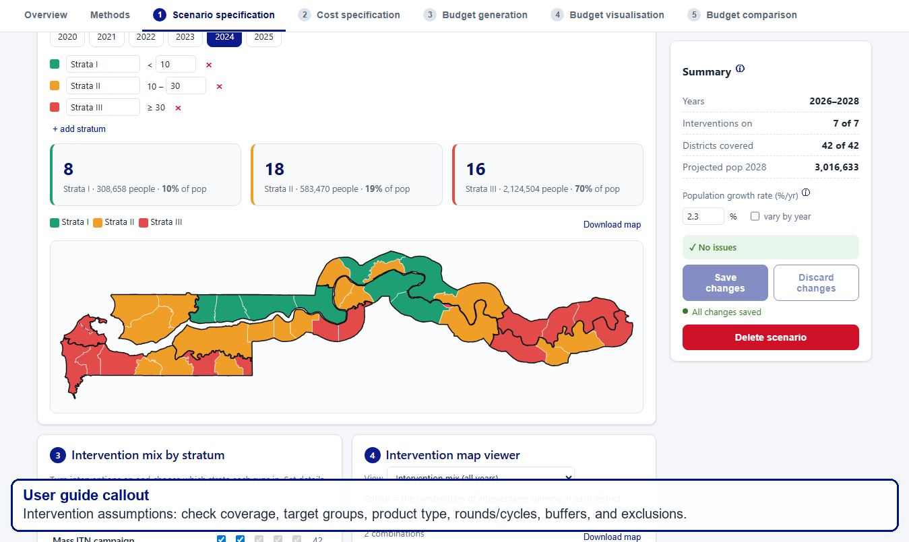

Common assumptions include:

- coverage: the percentage of the target group reached
- target population: the population group used for the intervention
- commodity or product type: for example net type, IRS insecticide, vaccine product, or drug type
- rounds, cycles, doses, or contacts: how many times the intervention is delivered
- buffer or wastage: additional commodity quantity added above the calculated need
- exclusions: areas or groups intentionally left out

Intervention-specific caveats:

- Mass ITN campaign: check people per net, campaign year, buffer, net type, and any reductions from maximum nets per household or excluded areas.
- Routine / continuous ITN: check routine coverage and whether routine distribution is paused after a mass campaign. If routine nets are paused, the reduction should carry through to both quantification and costing.
- IRS: check insecticide type. Product options are Actellic, SumiShield, and Fludora Fusion. Insecticide procurement costs require exact type matching.
- SMC: check coverage, cycles, buffer, and age-pack assumptions. Commodity quantities are split into SP+AQ 3-11m and SP+AQ 12-59m.
- IPT for school-age children: check drug type, cycles, coverage, and age-pack assumptions. DHA-PPQ is split into younger and older school-age packs.
- Malaria vaccine: check dose coverages and product type. Dose quantities are based on the eligible infant cohort and summed dose coverages.
- IPTp in pregnancy: check ANC contact coverages and whether a matching SP cost pathway exists in the cost set.

What to check before saving:

- The correct interventions are switched on.
- Intervention coverage assumptions are plausible.
- Product/type selections match what you expect to cost.
- Any reductions or exclusions are intentional.
- The Summary panel does not show unexpected issues.

### Step 6: Save The Scenario

Changes are not final until you save. If you navigate away with unsaved edits, the app may warn you.

After saving, wait for the top-right shared status to show `Shared data saved` before closing the browser.

If you change a scenario after generating a budget, the old budget becomes out of date. Regenerate the budget from Budget generation before relying on outputs.

## Cost Specification Walkthrough

Use Cost specification to review and edit unit costs. A cost set is a collection of cost rows that the budget engine uses to cost quantities from the scenario.

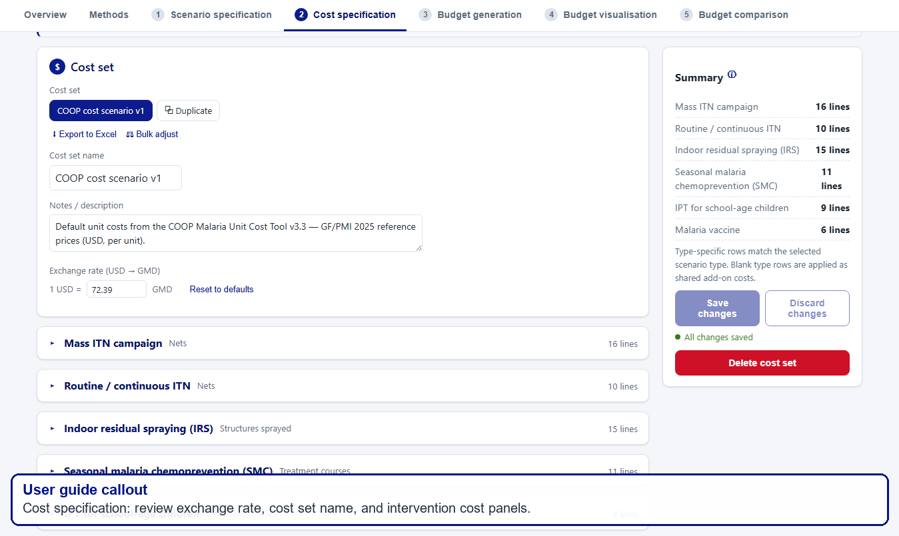

### Step 1: Choose Or Create A Cost Set

You can select an existing cost set, duplicate it, or create a new one.

Recommended approach: duplicate the existing cost set before making major changes. This makes it easier to compare the original cost assumptions against revised assumptions.

### Step 2: Check Exchange Rate

The tool stores unit costs in USD and converts to Gambian dalasi using the exchange rate in the cost set.

Check the exchange rate before generating budgets. If you change it, regenerate budgets that use that cost set.

### Step 3: Review Cost Rows

Each cost row describes one cost element. Typical fields include:

- intervention
- cost category
- cost description
- unit
- unit cost
- type
- source

The cost description and source are important because they explain what evidence or assumption the cost is based on. Keep descriptions clear when adding new rows.

### Step 4: Understand Cost Categories

Cost rows are grouped into categories such as procurement, distribution, operations, support, and monitoring & evaluation. Summaries and charts roll up from line-item costs to these categories.

Procurement rows usually cost the commodity itself. Operational, distribution, support, and monitoring rows may cost delivery activities, supervision, staff time, per diems, transport, or other implementation costs.

### Step 5: Understand Units

The unit controls which quantity the engine uses for costing.

Examples:

- Per net, per structure, per dose, per pack, and per treatment course use the commodity quantity.
- Per child and per person use the coverage-adjusted target population.
- Per year applies once for each active intervention year.
- One-off applies once for the whole budget.

Caveat: The unit must match the intended costing logic. For example, a per-child training or administration cost should not be multiplied by every cycle unless it is genuinely incurred every cycle.

### Step 6: Understand Type Matching

Typed commodity rows must match the scenario product or commodity type exactly.

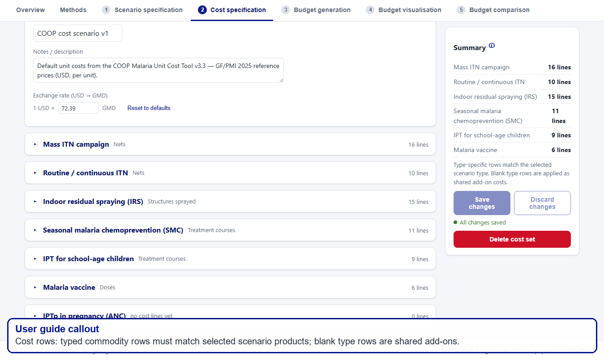

Examples:

- IRS Actellic only uses Actellic insecticide procurement rows.
- IRS SumiShield only uses SumiShield insecticide procurement rows.
- IRS Fludora Fusion only uses Fludora Fusion insecticide procurement rows.
- SMC procurement is split by SP+AQ 3-11m and SP+AQ 12-59m.
- IPTsc DHA-PPQ procurement is split by DHA-PPQ 5-11y and DHA-PPQ 12-15y.
- Routine and campaign ITN procurement rows should match the selected net type.

Blank type rows are shared add-on rows. They apply to that intervention regardless of the selected product type. Examples include supervision, logistics, training, distribution, or monitoring rows.

Caveat: A blank type row should not be used as a fallback procurement price for a missing product. If a selected product has no matching typed procurement row, the tool should warn you.

### Step 7: Save The Cost Set

After editing unit costs, save the cost set. Then wait for `Shared data saved` before closing.

If you change a cost set after generating a budget, the old budget becomes out of date. Regenerate the budget before using the outputs.

## Budget Generation Walkthrough

Use Budget generation to combine one scenario and one cost set. This creates the actual generated budget used in visualisations, comparisons, and exports.

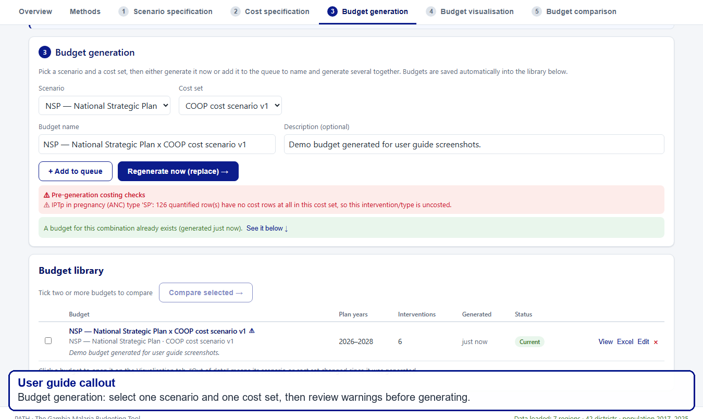

### Step 1: Select Scenario And Cost Set

Choose the scenario and cost set from the dropdowns. The budget name will be filled automatically, but you can edit it.

Use a clear name. A good name includes both the scenario and cost assumptions, for example ?NSP x COOP cost scenario v1?.

### Step 2: Read Pre-generation Warnings

Before generating, read any warnings shown in the red pre-generation checks box.

Common warning types:

- an intervention is switched on but has no matching cost rows
- a selected product or drug type has no exact typed procurement row
- a quantity row is costed only with shared blank-type add-ons
- a cost row has a missing price, missing unit, unsupported unit, or invalid category
- an intervention has zero quantity because of geography, years, or coverage settings

Warnings usually do not block generation. They are there so you know where a budget may be incomplete or where assumptions need review.

### Step 3: Generate Or Regenerate

Click Generate now to create a budget.

If a budget already exists for the selected scenario and cost set, the button may offer to regenerate or replace it. Regenerate when the scenario or cost set has changed.

You can also add multiple scenario and cost set combinations to the queue and generate them together. This is useful for comparing several planning options.

### Step 4: Check The Budget Library

Generated budgets appear in the Budget library.

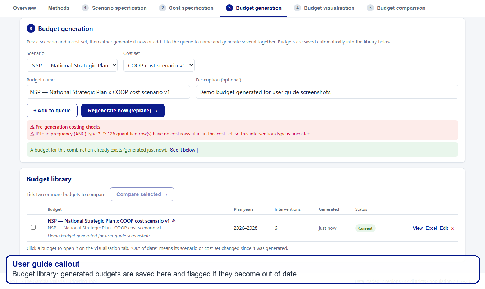

In the library, check:

- budget name
- plan years
- number of interventions
- generated date
- status
- links to view, export Excel, edit, or delete

Status meanings:

- Current: the budget matches the current saved scenario and cost set.
- Out of date: the scenario or cost set changed after the budget was generated.
- Source deleted: the original scenario or cost set is no longer available.

What to check before moving on:

- The budget appears in the library.
- The status is Current.
- The shared status in the header says `Shared data saved`.
- Any warnings are understood and acceptable.

## Budget Visualisation Walkthrough

Use Budget visualisation to explore one generated budget. This is the main place to review results, charts, maps, and detailed cost drivers.

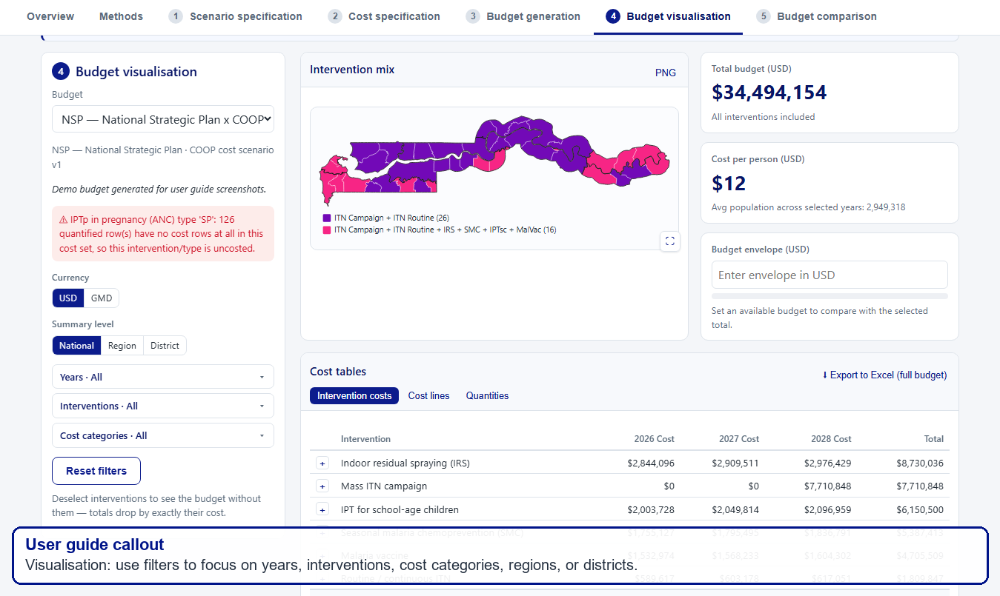

### Step 1: Select A Budget

Use the Budget dropdown in the left panel to select the generated budget you want to review.

If a budget is out of date, the page will show a warning. Regenerate the budget before using it for decisions.

### Step 2: Use Filters

The filter panel lets you focus the analysis.

You can filter by:

- currency: USD or GMD
- summary level: national, region, or district
- years
- interventions
- cost categories
- regions and districts

Tip: Deselecting an intervention shows the budget without that intervention. The total drops by exactly that intervention?s cost, which is useful for ?what if? discussions.

### Step 3: Review The Main Totals

The visualisation page shows the total budget and cost per person for the selected filters. It can also compare the selected total against an available funding envelope.

Use the funding envelope field when you want to ask: ?If this is the available budget, how much is the plan over or under??

### Step 4: Review Tables

The cost tables show intervention costs, detailed cost lines, and quantities.

Use these tables when you want to check where a total comes from. The line detail is especially useful for validating that the correct unit costs and quantities were applied.

### Step 5: Review Charts

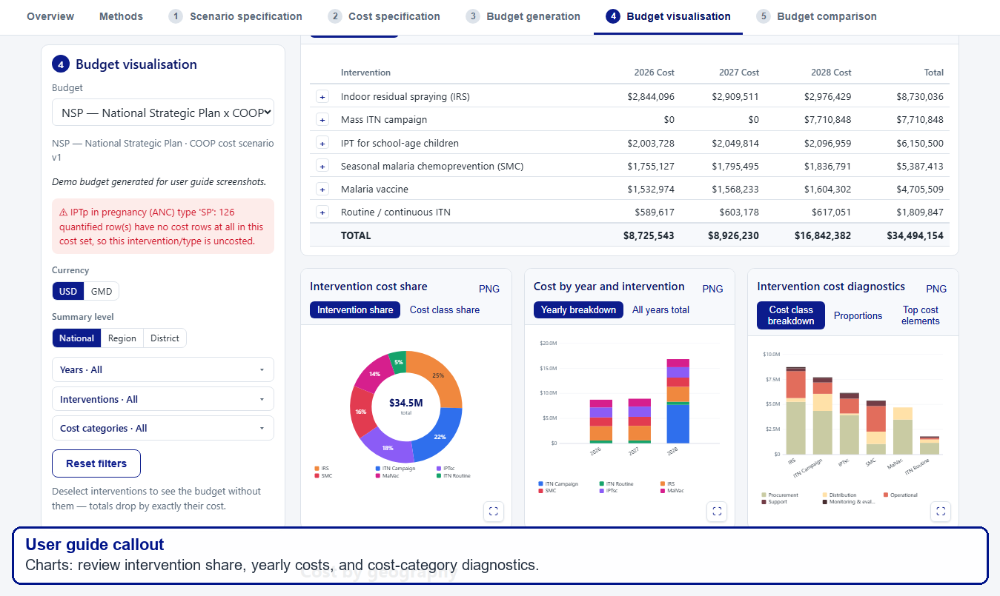

Key charts include:

- intervention cost share
- yearly cost by intervention
- cost class breakdown
- cost class proportions
- top cost elements

Use the expand icon in the bottom-right corner of chart cards to view charts at a larger size. Use PNG links to download chart images.

### Step 6: Review Top Cost Elements

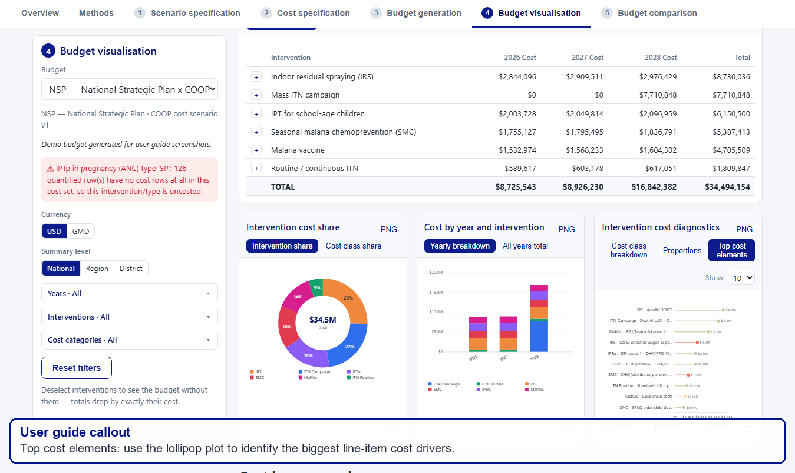

The top cost elements plot shows the largest line-item cost drivers. This is more specific than an intervention total because it shows the actual cost description, such as a commodity, per diem, or cold-chain line.

Use the dropdown in the chart card to choose how many elements to show.

When reviewing this plot, ask:

- Are the largest cost elements expected?
- Are the descriptions clear enough to explain to others?
- Do the unit costs and quantities make sense in the Excel Cost detail sheet?
- Is a large cost driven by procurement, delivery, operations, support, or monitoring?

### Step 7: Export Excel

Use Export to Excel when you want a full workbook for checking, sharing, or archiving.

The Excel export is the best way to audit line-by-line calculations outside the app.

## Budget Comparison Walkthrough

Use Budget comparison to compare two or more generated budgets.

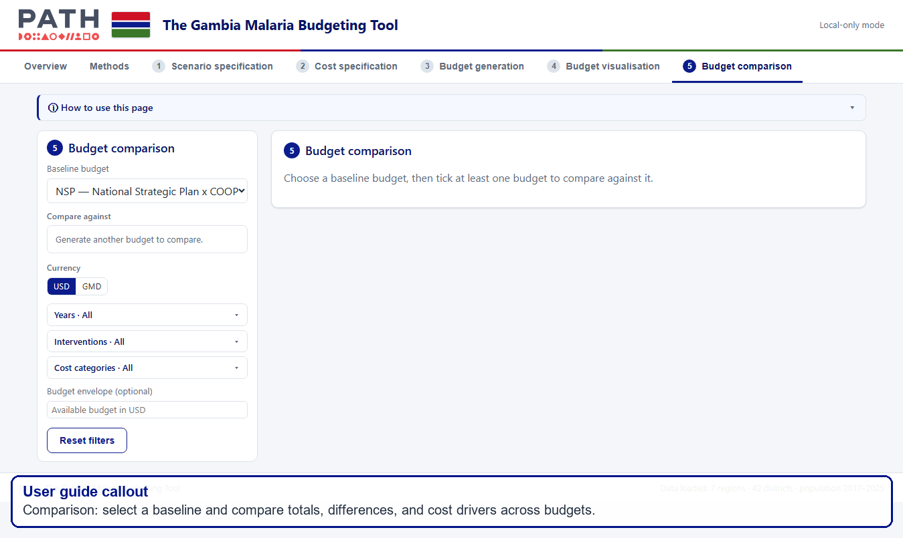

### Step 1: Select Budgets

Choose a baseline budget, then select one or more comparison budgets.

The baseline is the reference point. Differences are shown relative to it.

### Step 2: Interpret Differences

Use the comparison outputs to understand:

- which budget is larger or smaller
- how much the total changes
- which interventions or categories drive the difference
- how the yearly profile changes
- whether a budget fits within an available funding envelope

### Step 3: Check Stale Budget Warnings

If either the baseline or comparison budget is out of date, regenerate it before relying on the comparison.

Comparison is only meaningful when the selected budgets were generated from the intended scenarios and cost sets.

## Excel Export Guide

Excel exports are designed for checking and sharing results outside the app. They should be treated as audit workbooks, not just summary tables.

Useful sheets include:

- Summary sheets: high-level totals by year, intervention, category, or geography.
- Quantities: target populations, coverage-adjusted populations, commodity quantities, and quantity basis.
- Cost detail: line-by-line cost calculations.
- Diagnostics: warnings and notes saved with the budget.
- Source status: whether the budget is current, out of date, or linked to deleted sources.
- Assumptions snapshot: scenario settings used to generate the budget.
- Cost set audit: which cost rows were used, matched, unused, unsupported, or skipped.
- Top cost elements: the same line-item aggregation used in the lollipop plot.

### How To Cross-check A Budget In Excel

Start with the Cost detail sheet.

For each line, check:

1. Intervention and type.
2. Cost description and source.
3. Unit.
4. Quantity used for cost.
5. Unit cost.
6. Line cost.
7. Cost category.

The basic calculation is:

`line cost = quantity used for cost x unit cost`

Then check that the sum of line costs matches the summary totals. If totals do not reconcile, use the Diagnostics and Cost set audit sheets to look for missing, skipped, or unsupported rows.

## Practical Interpretation Tips

When using the tool in a meeting or review:

- Start with the scenario description so everyone knows what is being costed.
- Check warning messages before discussing totals.
- Use the intervention share chart to explain broad cost drivers.
- Use the top cost elements plot to explain specific line-item drivers.
- Use the funding envelope field to show whether a plan is affordable under a given available budget.
- Export Excel when someone needs to check the exact calculation.

When editing assumptions:

- Change one major assumption at a time when possible.
- Duplicate scenarios or cost sets before major edits.
- Regenerate budgets after changing scenarios or costs.
- Compare the old and new budgets to understand what changed.

## Troubleshooting

### You Cannot Sign In

Check that your username is your email address and that the temporary password was entered exactly.

If you already reset your password, use your new password.

Contact Hayley if you are still blocked.

### You Do Not See A Budget Someone Else Generated

Refresh the app and wait for `Shared data loaded`.

If the budget still does not appear, ask the person who generated it to confirm that their browser showed `Shared data saved`.

Do not click `Sync now` from an empty browser unless asked during troubleshooting.

### A Budget Is Out Of Date

This means the source scenario or cost set changed after the budget was generated.

Go to Budget generation and regenerate the budget.

### You See Pre-generation Warnings

Read the warning text before using the budget.

Common warnings include:

- an intervention is switched on but has no matching cost rows
- a selected product or drug type does not have an exact matching procurement cost
- an intervention is costed only with shared add-on costs
- a cost row has a missing price or unsupported unit

Warnings help identify where assumptions or unit costs may need review.

### Shared Saving Shows An Error

Do not keep making changes in multiple browsers.

Take a screenshot of the message and contact Hayley.

### You Are Unsure Whether To Click Sync Now

Do not click it unless asked during troubleshooting, or unless you know the current browser has the budget library that should be preserved.

### A Chart Or Table Does Not Look Right

Check whether filters are active. A chart may look different because only some years, interventions, cost categories, regions, or districts are selected.

Use Reset filters to return to the full budget view.

### A Budget Total Looks Too Low

Check:

- whether all expected interventions are selected in the visualisation filters
- whether the scenario includes all expected geographies
- whether coverage is zero or very low for an intervention
- whether a pre-generation warning says procurement costs are missing
- whether the cost set has matching typed rows for the selected commodity or product

### A Budget Total Looks Too High

Check:

- whether cycles, rounds, doses, or contacts are higher than expected
- whether a per-child or per-person cost was accidentally entered as a per-dose or per-pack cost
- whether a fixed yearly cost is being applied in every active year
- whether duplicate cost rows exist in the cost set

## Final Checklist Before Sharing Outputs

Before sharing charts, tables, or Excel exports, check:

- The budget status is Current.
- The selected scenario and cost set are correct.
- Pre-generation warnings have been reviewed.
- The filter settings match the question being answered.
- The currency is correct.
- The Excel export has been generated after the latest budget regeneration.
- The header showed `Shared data saved` before closing the app.
