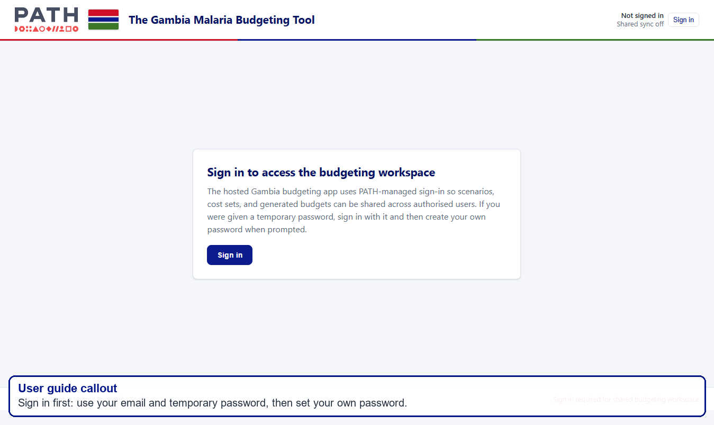
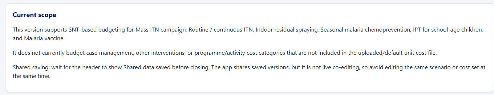
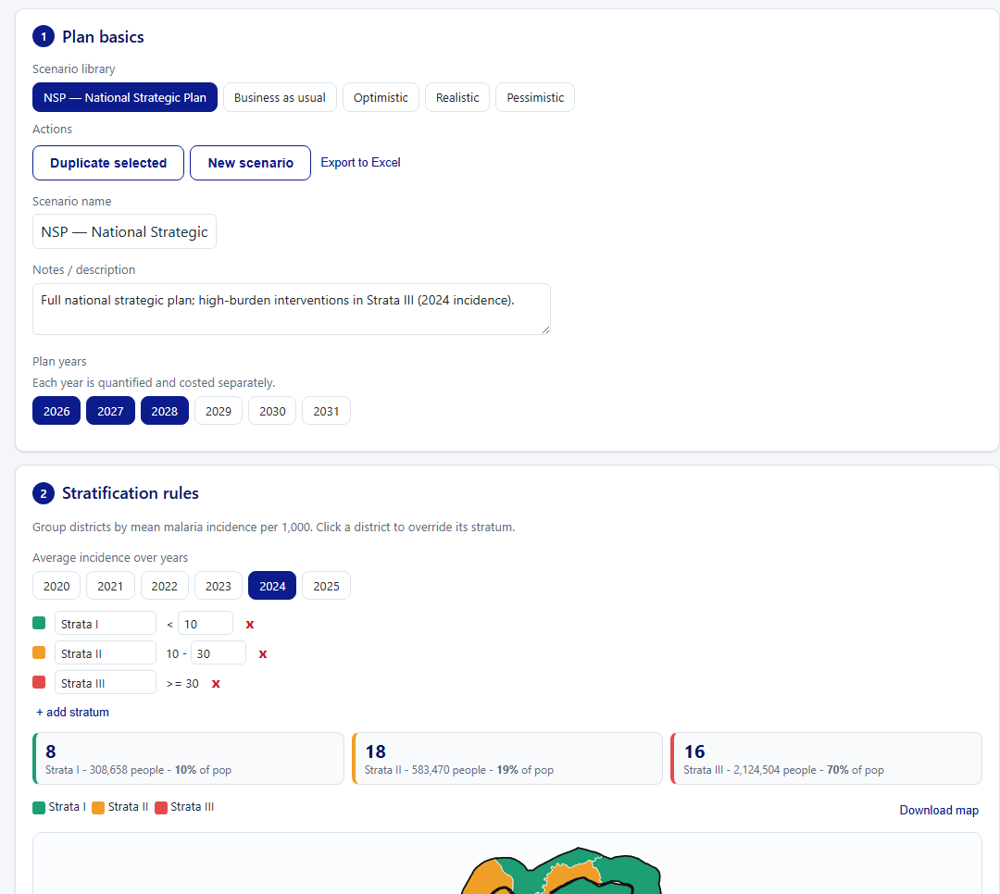
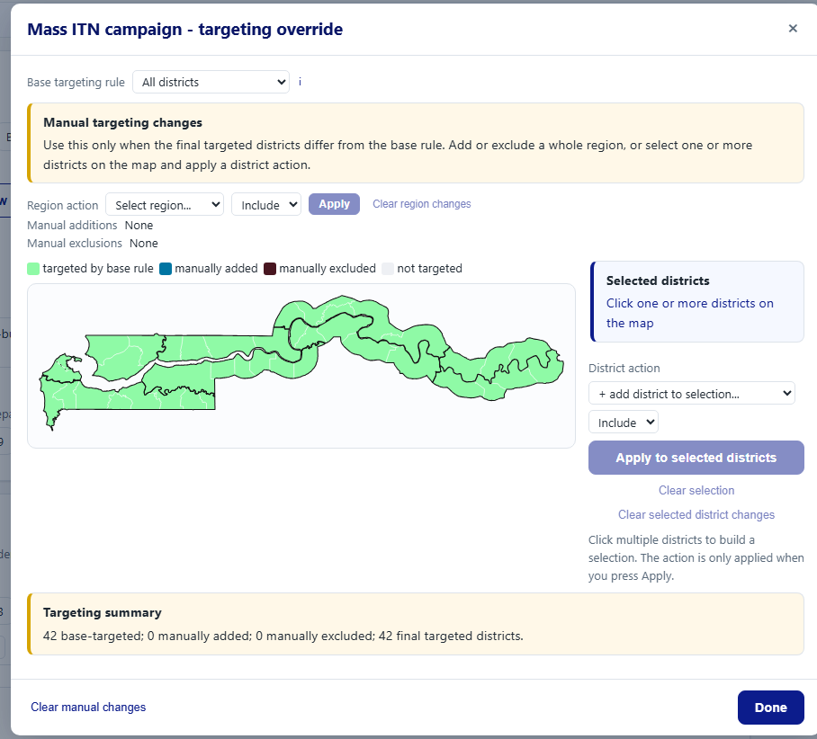
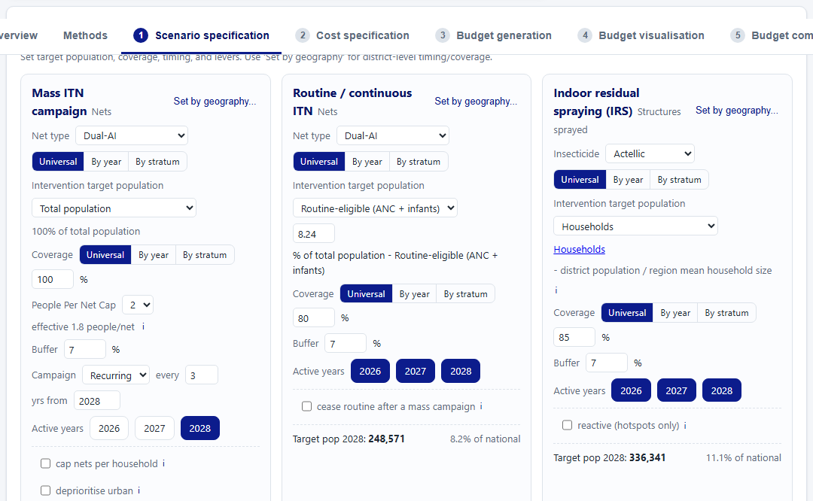
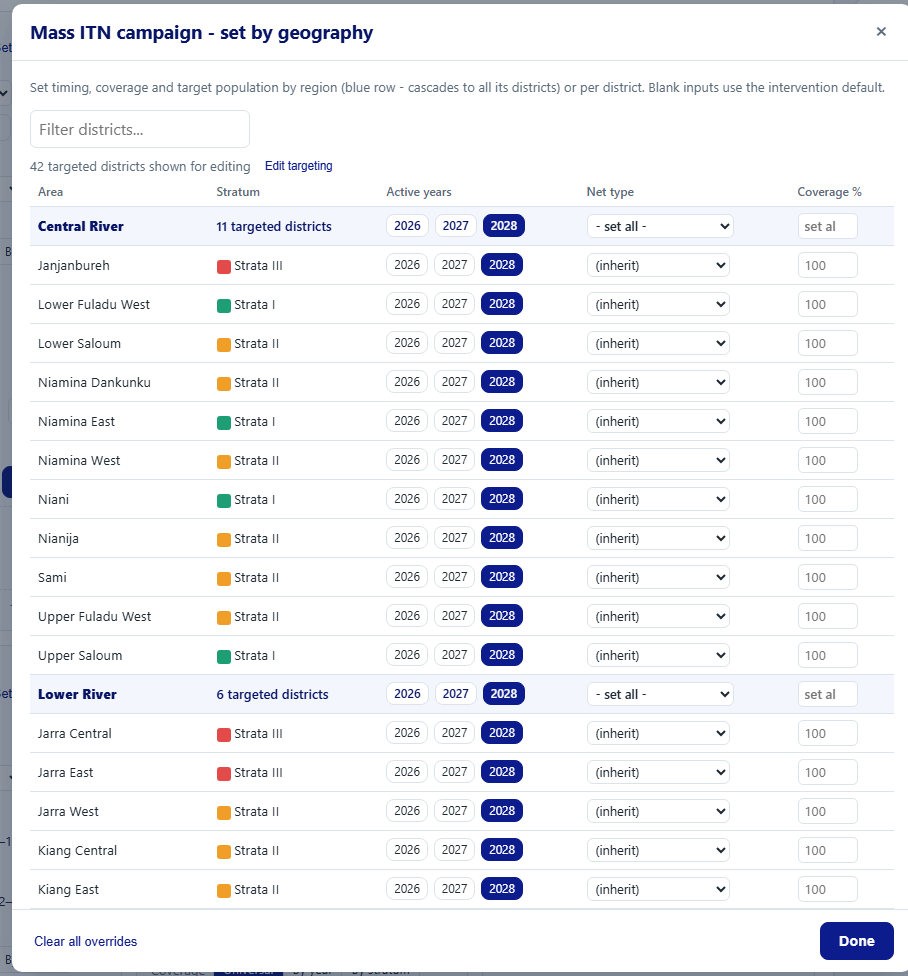
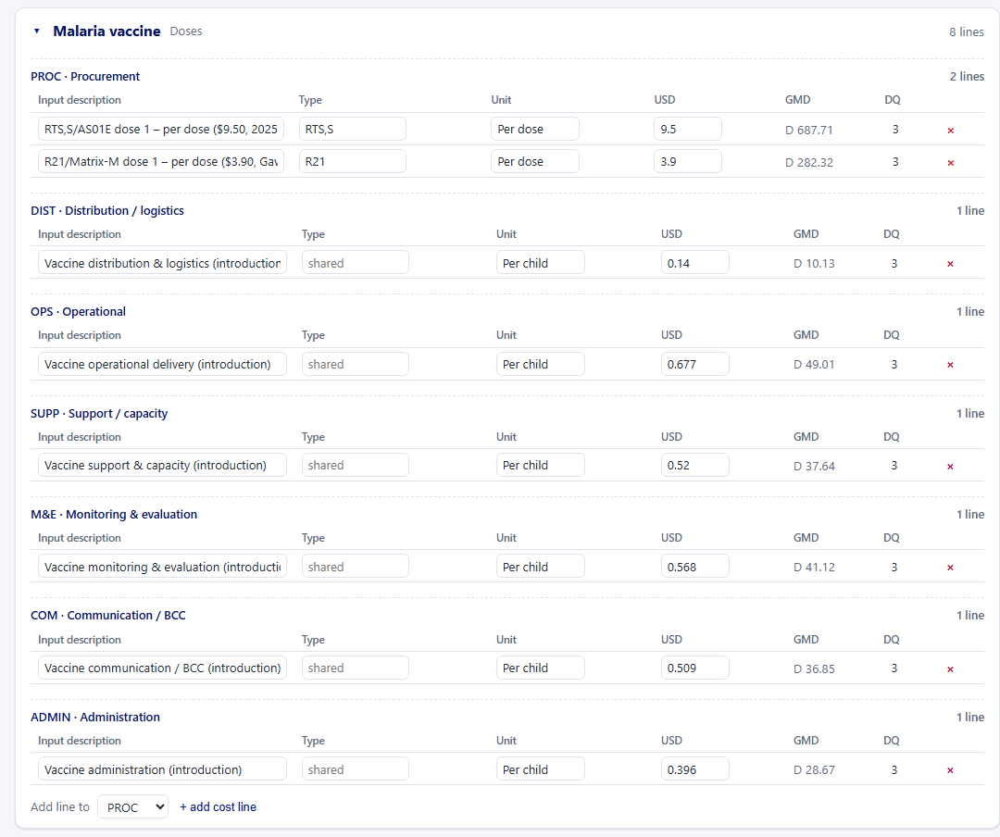

# The Gambia Malaria Budgeting Tool: Detailed User Guide

Live app: https://path-global-health.github.io/gmb-malaria-budget-app/

This guide is for programme users who need to use, check, or explain outputs from The Gambia Malaria Budgeting Tool. It is written as a practical walkthrough: what each page is for, what to click, what to check before moving on, and what common warnings mean. You do not need GitHub, AWS, or software development knowledge to use the tool.

## Quick Orientation

The app turns an SNT-style malaria plan into a costed, multi-year budget. You define which interventions are delivered, where they are delivered, in which years, and at what coverage. The tool then combines that scenario with a unit cost set to generate budget tables, maps, charts, comparisons, and Excel exports.

The workflow is arranged across the top of the app:

1. Scenario specification: define the plan and intervention assumptions.
2. Cost specification: review or edit unit costs.
3. Budget generation: combine a scenario and cost set.
4. Budget visualisation: review one generated budget.
5. Budget comparison: compare generated budgets.

The Methods tab is a reference section. It explains the formulas, assumptions, type-matching logic, line-item costing, and worked examples.

## Current Scope Of The Tool

The current Gambia version supports SNT-based budgeting for these six intervention areas:

- Mass ITN campaign
- Routine / continuous ITN
- Indoor residual spraying
- Seasonal malaria chemoprevention
- IPT for school-age children
- Malaria vaccine

The current version does not support:

- case management
- other malaria interventions
- programme or activity cost areas that are not represented in the uploaded/default unit cost file
- real-time expenditure tracking
- live co-editing like Google Docs
- automatic production of a full GF detailed budget template

IPTp is archived in this version. Older saved budgets that contain IPTp rows can still be displayed or exported, but IPTp is not part of the current scenario setup or new budget-generation workflow.

Use this tool for strategic planning, scenario comparison, funding gap discussions, and checking major cost drivers. Do not use it as the only source for activity-level workplanning, procurement orders, or expenditure monitoring.

## Getting Started And Signing In

Open the live app in a browser:

https://path-global-health.github.io/gmb-malaria-budget-app/

Use your email address as your username. If you were given a temporary password, enter it at first sign-in and then create your own password when prompted.

After signing in, check the top-right corner of the app:

- Your email address should appear.
- The shared saving status should move through loading and then show `Shared data loaded` or `Shared data saved`.
- The workflow tabs should be visible.

If the page seems stuck after sign-in, refresh the page once and wait for the shared status to update.

## Shared Saving And Collaboration

The hosted app shares saved scenarios, cost sets, and generated budgets across authorised users. This is what lets one person generate a budget and another person open it later.

The top-right corner shows the shared saving status:

- `Shared data loaded` means the browser loaded the shared workspace.
- `Shared data saved` means the latest saved work reached shared storage.
- `Saving shared data...` means the app is still saving.
- `Shared save skipped` means the app prevented this browser from overwriting shared budgets, usually because this browser has no local budget library to preserve.
- `Shared save failed` means the app could not save to shared storage. Your browser may still hold local changes, but ask for support before closing if the work is important.

Important habits:

- Wait for `Shared data saved` before closing the browser.
- If you open the app in a second browser, hard refresh and wait for `Shared data loaded`.
- Use `Sync now` only from a browser that has the budget library you want to preserve.
- Avoid two people editing the same scenario or cost set at the same time. The app is shared storage, not live co-editing.

Plain-language example: if two people open the same scenario at 10:00 and both edit it, the person who saves last may overwrite the other person's changes. Agree who is editing before making major changes.

## Overview Page

The Overview page is the starting point. It summarises the workflow and shows the current scope of the tool. Use it to orient new users before they move into the scenario and cost pages.

Before moving on, check:

- The footer says reference data are loaded.
- The current scope matches the work you are trying to do.
- You understand that unsupported interventions or cost activities cannot be budgeted unless they are added to the scenario logic and cost file.

## Scenario Specification Walkthrough

Use Scenario specification to define the malaria plan. This page controls what the budget engine will quantify: target districts, plan years, intervention mix, product choices, coverage, cycles, buffers, and special levers such as ITN caps or routine-net pauses.

### Step 1: Choose A Scenario

At the top of the page, the Scenario library shows saved scenario chips. Click a chip to open that scenario.

The action buttons are separate from the scenario chips:

- `Duplicate selected`: creates a copy of the currently selected scenario.
- `New scenario`: starts a blank/new scenario.
- `Export to Excel`: exports the selected scenario assumptions.

Tip: duplicate before making major edits. It gives you a clean comparison version and protects the previous scenario.

Check before moving on:

- The selected chip is the scenario you intend to edit.
- The scenario name and notes describe the plan clearly.
- If you are editing an existing scenario, confirm with colleagues that nobody else is editing it at the same time.

### Step 2: Review Plan Basics

In Plan basics, check:

- Scenario name
- Notes / description
- Plan years
- Population growth rate

Each selected plan year is quantified and costed separately. If a year is switched off, no quantities or costs should be generated for that year.

If you change plan years or population growth, existing budgets generated from this scenario should be treated as out of date and regenerated.

### Step 3: Review Stratification Rules

The stratification section groups districts by malaria incidence. These strata are then used as base rules for intervention targeting.

Typical checks:

- Incidence years: confirm which incidence year(s) are used for stratification.
- Stratum thresholds: check the cut-off values.
- District counts: review how many districts and people are in each stratum.
- Map: check that the district distribution looks plausible.

Changing a threshold can move districts between strata. Because intervention targeting can be based on strata, this may change which districts receive IRS, SMC, IPTsc, vaccine, or other interventions. Regenerate affected budgets after changing thresholds.

### Step 4: Review Intervention Mix By Stratum

The intervention mix table is one of the most important setup areas. It controls whether each intervention is on and which districts are targeted before any manual overrides are applied.

For each intervention, review:

- `On`: whether the intervention is active.
- `All`: whether all districts are targeted by the base rule.
- `S I`, `S II`, `S III`: whether the base rule targets those strata.
- `Base`: the base targeting rule.
- `Manual`: whether manual additions or exclusions have been applied.
- `Final`: the number of districts targeted after base rules plus manual changes.

The intervention map viewer beside the table shows where interventions are running. Use it to check that the table and map tell the same story. The all-interventions map should update when you change an intervention's targeting or manual exclusions.

What to check before moving on:

- Each intervention that should be budgeted is switched on.
- The base strata match the programme strategy.
- Any custom additions/exclusions are intentional.
- The final district count looks right.

### Step 5: Use Manual Targeting Overrides

Click `Edit targeting` for an intervention when the final district list should differ from the base stratum rule.

The targeting override modal lets you:

- keep a base rule, such as all districts or selected strata
- manually include a full region
- manually exclude a full region
- manually include selected districts
- manually exclude selected districts
- clear manual changes

The map uses a specific colour logic:

- Light green: targeted by the base rule
- Blue: manually added
- Dark burgundy: manually excluded
- Grey: not targeted

District actions are deliberate. Click one or more districts on the map, choose include or exclude, and then apply the action. This reduces accidental changes because clicking the map alone does not immediately change the scenario.

Use manual exclusions when a district should not receive an intervention at all. Excluded districts are removed from targeting, quantification, costing, diagnostics, maps, and exports for that intervention.

This is different from partial quantity levers. For example, `deprioritise urban` for ITNs reduces quantities in eligible areas but does not mean the district is fully untargeted.

### Step 6: Review Intervention Assumptions

The intervention specification cards set the quantities that feed the budget. Review each intervention that is switched on.

For Mass ITN campaign, check:

- Net type
- Target population
- Coverage
- People Per Net Cap
- Buffer
- Campaign timing and active years
- Household cap option
- Urban deprioritisation option

People Per Net Cap is programme-facing language. It maps to an internal effective people-per-net value used for quantification:

- Cap `2` uses effective `1.8` people per net.
- Cap `3` uses effective `2.7` people per net.

The formula is:

`nets = target population x coverage / effective people per net x (1 + buffer)`

If a mass campaign is set as recurring, check the campaign interval and the first campaign year. The target population shown on the Mass ITN card uses the active campaign year, not simply the final scenario year.

For Routine / continuous ITN, check:

- Net type
- Routine-eligible target population
- Coverage
- Buffer
- Active years
- Whether routine nets pause after a mass campaign

If routine nets pause after a mass campaign, users enter pause months. The tool converts this into a percentage reduction using the Mass ITN campaign interval:

`reduction percentage = pause months / (campaign interval years x 12)`

Example: if the Mass ITN campaign interval is 3 years and routine nets pause for 6 months, the reduction is `6 / 36 = 16.7%`.

For IRS, check:

- Insecticide selected: Actellic, SumiShield, or Fludora Fusion
- Target population, usually households/structures
- Coverage
- Buffer
- Active years
- Any reactive/hotspot option if used

IRS procurement costs are type matched. If Actellic is selected, only Actellic product rows should be used plus shared blank-type add-on rows.

For SMC, check:

- Drug type
- Target age group
- Coverage
- Cycles
- Buffer
- Active years

SMC procurement is split by age/pack:

- `SP+AQ 3-11m`
- `SP+AQ 12-59m`

Per-child costs use covered children. Per-dose, per-pack, or per-treatment-course costs use cycle-adjusted commodity quantities.

For IPT for school-age children, check:

- Drug type
- Coverage
- Cycles / rounds
- Buffer
- Active years

IPTsc procurement is split by school-age pack where applicable:

- `DHA-PPQ 5-11y`
- `DHA-PPQ 12-15y`

If SP-AQ or SP is selected but no matching typed procurement row exists in the cost set, the tool will cost legitimate shared add-ons and warn that procurement is missing.

For Malaria vaccine, check:

- Vaccine product
- Eligible infant cohort
- Dose coverages
- Active years

Vaccine procurement rows remain product-specific. Vaccine delivery, administration, communication, support, and monitoring rows are shared add-ons unless a typed row is provided.

### Step 7: Use Set By Geography

Click `Set by geography...` on an intervention card when timing, product, coverage, or target assumptions differ by region or district.

The modal is organised by region and district. Region rows can be used to set assumptions for all districts in that region, while district rows can be used for specific local changes.

Excluded districts are respected here. By default, excluded rows are hidden so users do not accidentally configure districts that are not targeted. Use the show-excluded toggle only when you need to audit or troubleshoot exclusions.

What to check before moving on:

- The number of targeted districts shown in the modal matches your expectation.
- Region-level settings have cascaded as intended.
- District-level overrides are only used where genuinely needed.
- Excluded districts are not being unintentionally configured.

### Step 8: Save The Scenario

Use the summary panel on the right to save scenario changes. The save state should show whether there are unsaved changes.

Before leaving the page:

- Click `Save changes` if the scenario was edited.
- Wait for the shared status to show `Shared data saved`.
- Remember that budgets generated before the edit will become out of date and should be regenerated.

## Cost Specification Walkthrough

Use Cost specification to review or edit the unit cost set. A cost set is a library of line-item costs. The budget engine costs each matched line item, then aggregates those line items into summary tables and charts.

### Step 1: Choose A Cost Set

Click a cost set chip to open it. The default/reference cost set is currently labelled `COOP cost scenario v1`.

Before major edits:

- Duplicate the cost set if you want to preserve the previous version.
- Update the notes/description so colleagues understand what changed.
- Check that the exchange rate is correct.

### Step 2: Check Cost Row Fields

Each cost row includes:

- Intervention
- Cost category
- Input description
- Type
- Unit
- Unit cost in USD
- Local currency equivalent
- Data quality score
- Source information

The cost engine uses these rows as line items. It does not simply use one aggregate cost per intervention.

### Step 3: Understand Cost Categories

Cost categories are used for summaries and charts. Common categories include:

- Procurement
- Distribution / logistics
- Operational
- Support / capacity
- Monitoring & evaluation
- Communication / BCC
- Administration

If a row is assigned to the wrong category, the total budget may still be correct but category charts and tables will be misleading.

### Step 4: Understand Units

The unit controls which quantity is multiplied by the unit cost:

- `Per net`: uses net quantity.
- `Per structure`: uses structures sprayed.
- `Per dose`: uses dose quantity.
- `Per pack`: uses pack quantity.
- `Per treatment course`: uses treatment-course quantity.
- `Per child` and `Per person`: use coverage-adjusted target population.
- `Per year`: applies once per intervention year.
- `One-off`: applies once per budget.

If the unit is blank or unsupported, the row may be skipped and a warning should appear during budget generation.

### Step 5: Understand Type Matching

Typed procurement rows must match the scenario-selected type exactly. Blank-type rows are shared add-on rows and can apply across product types.

Examples:

- IRS selected as Actellic uses Actellic procurement rows plus blank-type IRS add-ons.
- IRS selected as SumiShield uses SumiShield procurement rows plus blank-type IRS add-ons.
- SMC age-pack quantities match `SP+AQ 3-11m` and `SP+AQ 12-59m`.
- IPTsc DHA-PPQ quantities match `DHA-PPQ 5-11y` and `DHA-PPQ 12-15y`.
- ITN campaign and routine ITN procurement rows should match the selected net type.
- Vaccine procurement rows should match the selected vaccine product.

If a typed commodity is selected but no exact typed procurement row exists, the tool should warn. It may still cost shared add-on rows where those are legitimate.

### Step 6: Edit Data Quality Scores

Data quality scores appear as coloured DQ score pills. Click or tab into the pill and type:

- `1`: model estimate
- `2`: programme data
- `3`: primary study
- blank: not set

The colour and label help users quickly identify how reliable or evidence-based a cost row is. After editing a DQ score or any other row field, the save state should show unsaved changes.

### Step 7: Vaccine Delivery Rows

The current cost set keeps the vaccine procurement rows unchanged and includes updated vaccine delivery/support rows. The key current vaccine row structure is:

- Procurement: RTS,S dose row
- Procurement: R21/Matrix-M dose row
- Distribution / logistics: vaccine distribution and logistics
- Operational: vaccine operational delivery
- Support / capacity: vaccine support and capacity
- Monitoring & evaluation: vaccine monitoring and evaluation
- Communication / BCC: vaccine communication
- Administration: vaccine administration

Procurement rows are per dose. Most delivery/support rows are per child, so they scale with the covered infant cohort rather than being multiplied by every dose unless the row unit says otherwise.

### Step 8: Save The Cost Set

Before leaving Cost specification:

- Check the summary panel for unsaved changes.
- Click `Save changes`.
- Wait for `Shared data saved`.
- Regenerate budgets that use the edited cost set.

## Budget Generation Walkthrough

Use Budget generation to combine a scenario and a cost set.

### Step 1: Select Scenario And Cost Set

Choose the scenario and cost set from the dropdowns. The budget name will be suggested automatically but can be edited.

If you want a clean audit trail, keep budget names descriptive. For example:

- `NSP x COOP cost scenario v1`
- `Realistic 2 x COOP cost scenario v1`
- `Pessimistic x updated vaccine costs`

### Step 2: Read Pre-generation Warnings

The warning panel appears before generation when the tool detects possible costing issues.

Common warnings include:

- An enabled intervention has no cost rows.
- A selected product/type has no exact typed procurement row.
- A quantity row is only costed by shared blank-type add-ons.
- A cost row has an unsupported unit.
- A quantity is zero because no districts, years, or coverage are active.

Warnings are not automatically blockers. They tell you what to review before relying on the result.

High-priority warning example:

`IPT for school-age children type SP: no matching typed procurement row`

This means the tool can cost shared distribution or operational add-ons if present, but the drug procurement itself is missing from the selected cost set.

### Step 3: Generate, Regenerate, Or Queue

Use:

- `Generate now`: create a new budget for the selected scenario and cost set.
- `Regenerate now (replace)`: refresh an existing budget for the same scenario and cost set.
- `Add to queue`: prepare several runs and generate them together.
- `Regenerate all`: refresh all budgets whose source scenario and cost set still exist.

Regenerate when:

- a scenario changes
- a cost set changes
- the budget is marked out of date
- the costing engine or quantity logic has been updated

### Step 4: Check The Budget Library

The Budget library lists saved budgets. Use it to open, export, edit, delete, compare, or regenerate budgets.

Status labels:

- `Current`: the budget matches the current saved scenario and cost set.
- `Out of date`: the source scenario or cost set changed after the budget was generated.
- `Source deleted`: the original scenario or cost set no longer exists.

Out-of-date budgets remain viewable, but regenerate them before using outputs for decisions.

Before leaving the page:

- Confirm the new budget appears in the library.
- Wait for `Shared data saved`.
- If another user needs the budget, ask them to hard refresh and wait for `Shared data loaded`.

## Budget Visualisation Walkthrough

Use Budget visualisation to review one generated budget.

### Step 1: Select A Budget

Choose a budget from the dropdown. If the budget is out of date, the page will show a warning. Regenerate before relying on the outputs.

### Step 2: Use Filters

Filters can narrow the output by:

- years
- interventions
- cost categories
- geography
- currency
- summary level

When you filter out an intervention, totals drop by that intervention's cost. Filters are useful for analysis, but always reset filters before quoting the full budget total.

### Step 3: Review Maps And Charts

Maps show the geographic intervention mix and budget patterns. Charts summarise the budget by year, intervention, category, or geography.

Use the expand icon in the bottom-right corner of a chart or map to open it at a larger size. PNG downloads are available for sharing visuals in slides or documents.

### Step 4: Review Cost Tables

The cost tables have multiple views:

- Intervention costs: grouped summaries.
- Cost lines: line-item costs.
- Quantities: commodity and population quantities.

Use Cost lines when you need to understand exactly why a total is high or low. The line-item table is the best audit view because it shows descriptions, units, quantities, unit costs, and line costs.

### Step 5: Review Top Cost Elements

The top cost elements chart is a lollipop plot based on specific cost lines, not only broad intervention categories.

Use the top-N selector in the chart card to choose how many elements to display. The tooltip/details should show the cost description, intervention, category, unit cost, and quantity information where available.

### Step 6: Export Excel

Use the Excel export when you need to audit, share, or archive the budget. The export includes line-item detail, quantities, diagnostics, status information, assumptions, and summary sheets.

## Budget Comparison Walkthrough

Use Budget comparison to compare generated budgets.

### Step 1: Select Budgets

Select a baseline budget and one or more comparison budgets. Choose budgets generated from the scenarios you intend to compare.

Before interpreting differences, check:

- Each selected budget is current.
- The scenario and cost set names are clear.
- The same currency and filter settings are being used.

### Step 2: Review Cost Change

The comparison page includes a tabbed table card. The cost view shows cost change versus baseline by intervention.

For each intervention, review:

- baseline cost
- comparison cost
- absolute change
- percentage change

Use the table filters such as `has increases`, `has decreases`, and `all` to focus on the direction of change.

### Step 3: Review Commodity Change

The commodity view shows change in intervention commodity requirements versus baseline. It is organised to mirror the cost-change table so rows are easier to compare.

Use this view when a budget change needs to be explained by quantity changes, for example:

- fewer ITNs because of a different people-per-net cap
- fewer districts targeted by IRS or SMC
- fewer vaccine doses because fewer years or districts are active
- lower routine net quantities because routine distribution pauses after a mass campaign

Rows should be ordered consistently by intervention name across the cost and commodity views.

### Step 4: Check Stale Budget Warnings

If either the baseline or comparison budget is out of date, regenerate before relying on the comparison. A stale comparison can be misleading because it may compare old scenario logic to new scenario logic.

## Excel Export Guide

The Excel export is the strongest audit output. It is designed so programme staff can trace from high-level totals down to the line-item calculations.

Key sheets to use:

- Summary / totals sheets: quick review of budget totals.
- Cost detail: line-item costs, including intervention, type, description, unit, quantity used for costing, unit cost, source, and match metadata.
- Quantities: target populations, covered populations, commodity quantities, age bands, and quantity basis.
- Diagnostics: warnings and notes captured during budget generation.
- Source status: whether the scenario/cost set behind the budget is current or out of date.
- Assumptions snapshot: scenario inputs at the time of generation.
- Cost set audit: cost rows and whether they were used, matched, unused, unsupported, or missing required data.
- Top cost elements: the same line-item aggregation used by the lollipop plot.

### How To Cross-check A Budget In Excel

1. Open `Cost detail`.
2. Sum the `cost_usd` column.
3. Compare that sum to the budget total.
4. Group `Cost detail` by intervention and compare to intervention summary sheets.
5. Group `Cost detail` by cost category and compare to category summaries.
6. Open `Quantities` to check whether quantities look plausible.
7. Open `Diagnostics` to see whether anything was missing, skipped, or only partially costed.

If totals do not reconcile, use the line-item sheets first. They are the source of truth for the generated budget.

## Practical Interpretation Tips

Use budget totals together with quantities. A cost difference can come from:

- different target districts
- different coverage
- different years
- different product types
- different unit costs
- different unit handling, such as per child versus per dose
- routine-net pause assumptions
- ITN cap assumptions
- manual inclusions or exclusions

When explaining differences, try to say both what changed and why it changed. For example:

`Realistic 2 is lower than NSP mainly because the Mass ITN campaign applies a household/net cap and uses fewer ITNs, which reduces procurement, distribution, and operational line items linked to net quantities.`

## Troubleshooting

### You Cannot Sign In

Check:

- You are using the correct app link.
- Your username is your email address.
- You have accepted or reset the temporary password.
- The password was typed exactly.

If the login page accepts the password but returns you to the app without loading data, refresh once and wait for the shared status.

### You Do Not See A Budget Someone Else Generated

Try this sequence:

1. Hard refresh the browser.
2. Wait for `Shared data loaded`.
3. Open Budget generation and check the Budget library.
4. If still missing, ask the person who generated it whether their browser showed `Shared data saved`.

Do not click `Sync now` from a browser with no local budgets unless you are specifically troubleshooting with support.

### A Budget Is Out Of Date

This means the scenario or cost set changed after the budget was generated. Go to Budget generation and regenerate the budget before using it for decisions.

### You See Pre-generation Warnings

Warnings are prompts to check the setup. Read the intervention/type named in the warning.

Common responses:

- Missing typed procurement: add or correct the matching cost row, or accept that procurement is not costed.
- Shared add-ons only: check whether this is intentional.
- Zero quantity: check district targeting, active years, coverage, and cycles.
- Unsupported unit: edit the cost row unit to a supported value.

### Shared Saving Shows An Error

Do not close the browser immediately if important work was just created. Wait a few moments and try a refresh only if you are confident local changes are visible. If the error remains, ask for support and mention the exact message in the top-right corner.

### You Are Unsure Whether To Click Sync Now

Most users should not need `Sync now`. Use it only when you know this browser has the correct budget library that should be preserved in shared storage.

### A Chart Or Table Does Not Look Right

Check:

- Are filters active?
- Is the selected budget current?
- Is the expected intervention switched on?
- Are the expected districts targeted?
- Are manual exclusions applied?
- Does the cost set contain matching typed procurement rows?

### A Budget Total Looks Too Low

Possible explanations:

- An intervention is switched off.
- Districts or regions are excluded.
- Coverage is low or active years are missing.
- The selected product/type has no matching procurement cost.
- A cost row has an unsupported unit.
- Routine nets are reduced after a mass campaign.
- An ITN cap or deprioritisation lever is reducing net quantities.

### A Budget Total Looks Too High

Possible explanations:

- Too many districts are targeted.
- Coverage is set too high.
- The intervention is active in too many years.
- Per-dose or per-cycle costs are being applied to cycle-adjusted quantities.
- A one-off or per-year row is included unintentionally.
- A cost row is duplicated.

## Final Checklist Before Sharing Outputs

Before sending charts, tables, or Excel files to colleagues:

- Confirm the budget status is current.
- Reset filters unless you are intentionally sharing a filtered view.
- Check pre-generation diagnostics.
- Open Cost detail if a major total looks surprising.
- Confirm scenario assumptions, especially targeting, active years, coverage, ITN cap, and routine pause.
- Confirm cost set assumptions, especially product/type matching, unit costs, units, and DQ scores.
- Export Excel for any budget that will be reviewed outside the app.

